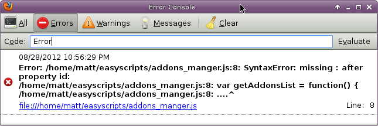

******************************
EasyScripts 编写指南(编辑中)
******************************

基本概念
===========

即时脚本
------------------

脚本不会被firefox缓存。也就是说是即时生效的。

两级命名空间
------------------

脚本可以导入到两个级别的命令空间,不会污染全局空间。

1. 匿名级别的脚本，相互间是独立隔绝的。用来实现具体功能。

2. 全局级别的脚本。可以相互访问,也可以被匿名脚本访问。用来编写公共库。

菜单界面
-----------

如果根据规范，easyscript可以根据描述自动生成调用菜单。

.. image:: menu.png

错误处理
-----------

在firefox控制台提供js、cofffeescript的编译时错误。方便debug。(默认不启用)

兼容coffeescript
-------------------

可以自动编译coffeescripts脚本。(默认不启用)

菜单映射规范
==============

__customMenus
---------------------

.. code-block:: coffeescript

    __customMenus =
	    "test":"无限菜单演示.L2.L3.L4.test"

脚本中要有一个叫 **__customMenus** 的局部object变量

EXPORT
---------------------

.. code-block:: coffeescript
    
    EXPORT = [__customMenus, test]

还要有一个叫 **EXPORT** 数组。用于放置__customMenus和菜单使用的函数

菜单命名
-------------------------

__customMenus中元素的key是是函数或对象名，value是菜单中的显示名.

**无限菜单演示.L2.L3.L4.test** 意味着有五级菜单

* 无限菜单演示
    * L2
        * L3
            * L4
                test   <-------- 执行test功能

this
------------------------

还有一种简单的写法，使用this:

.. code-block:: coffeescript

    this.__customMenus =
        "switchRestartless": "Addons.切换RestartLess扩展开闭状态(输入序号如:1,2)"
        "getAddonsList": "Addons.复制扩展列表和简单统计"

命名空间规范
======================

脚本目录
-------------

默认的脚本目录位于 $home/easyscripts.

全局级别
--------------

全局级别的脚本。可以相互访问,可以被匿名脚本访问。放置于默认脚本目录下的 **global** 目录

以下面的脚本为例： 脚本中的 **easyscript_app** 对象会被放置于 **window.easyscript_app** 。

当然你也可以起其他的名字。但 **easyscript_xxxx** 风格的变量会有一个优化。在匿名脚本中可以直接通过xxxx访问

.. code-block:: coffeescript
    
    EXPORT = [easyscript_app]

    easyscript_app =

        get_os : ->Services.appinfo.OS
        

匿名级别
-------------

匿名级别的脚本，相互间是独立隔绝的。可以放置于默认脚本目录。

以下面的脚本为例: 这个脚本会转化成一个对象，被放置于 **window.snippet.anonym.脚本ID** 。

注意： app.get_os() 实质上调用的是上面的 **easyscript_app** 里的方法。

.. code-block:: coffeescript
    
    EXPORT = [__customMenus, test]

    __customMenus =
        "test":"无限菜单演示.L2.L3.L4.test"

    test = ->alert app.get_os()

相互调用
---------------------

安装下载
=====================

依赖
---------

* coffeescript

* js解释器

  建议使用mozilla的spidermonkey. 理由是mozilla的js有一些非ES标准的语法。

  archlinux如下安装

  >>> pacman -S js

下载仓库
------------

 >>> git clone git@github.com:riptide766/easyscripts.git

生成和安装fireofox扩展
------------------------

>>> cd easyscripts
>>> ./packaging.py
>>> firefox xxxxx.xpi

