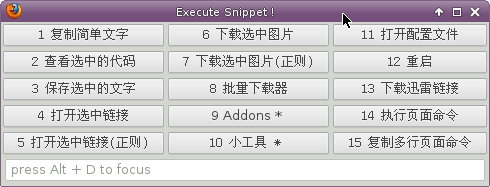

******************************
EasyScripts 使用指南
******************************

扩展安装
=============

1. 点击 `Downloads <https://github.com/riptide766/easyscripts/downloads>`_ 下载扩展和脚本示例

2. 安装扩展

3. 解压脚本到home目录

   正常的情况应该是这样的： $HOME/easyscripts

4. 重启firefox

使用方法
================

界面调出
-----------

Ctrl + e

菜单触发
------------

在菜单界面可以直接按相应的数字触发功能,例如:直接按数字 **12** 重启浏览器

灵活运用
---------

**在keyconfig、pentadactyl等扩展里可以使用下面的语句调用esayscripts**

打开调用界面(装载全部脚本)

>>>  snippet.core.getInstance().popup()

打开调用界面（指定某个脚本名字）

>>> snippet.core.getInstance().popup("pages")

pentadactyl里绑定Ctrl+e去调用脚本目录下的pages.js里的菜单

>>> map <silent> <C-e> -javascript snippet.core.getInstance().popup("pages")

