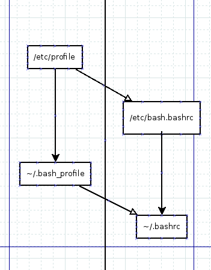

===================
Bash常识
===================

调用顺序
============

- These files are sourced by bash in different circumstances.

    - if interactive + login shell → /etc/profile then the first readable of ~/.bash_profile, ~/.bash_login, and ~/.profile
      
        Bash will source ~/.bash_logout upon exit. 
    
    - if interactive + non-login shell → /etc/bash.bashrc then ~/.bashrc
    
    - if login shell + legacy mode → /etc/profile then ~/.profile 

- But, in Arch, by default:

    - /etc/profile (indirectly) sources /etc/bash.bashrc
    
    - /etc/skel/.bash_profile which users are encouraged to copy to ~/.bash_profile, sources ~/.bashrc 

**which means that /etc/bash.bashrc and ~/.bashrc will be executed for all interactive shells, whether they are login shells or not.** 

