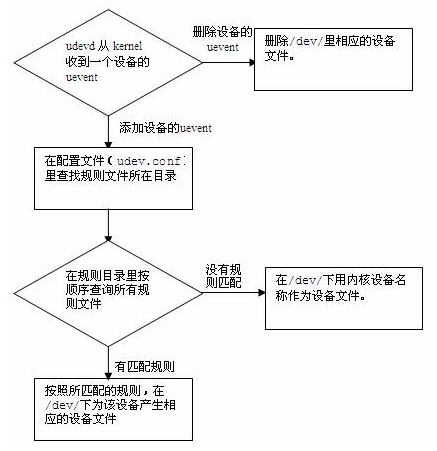

=================================
UDEV规则学习 
=================================

我有个这样的需求, 调查一番发觉采用udev解决比较好玩

 ::
    
    我一个liveusb，装有grub2. 可以选择安装ubuntu和archlinux。除此之外备份有archlinux(主系统)下的grub.cfg文件。
    
    这样可以保证在各种意外时，跳过硬盘mbr，装载这个文件，任意引导幸存的系统.

    但作为一个既折腾又比较懒的人来说，我不高兴有一点变化要手动更新这个文件.

    我希望插上U盘的时候，自动比较差别后更新文件。

Udevd触发流程
==================

udevadm
==================

udvadm是一个udev的管理工具。在写udev的过程中，这个命令可以辅助我们查看信息，模拟事件。 ::

    udevadm expects a command and command specific options. 
    
    It controls the runtime behavior of udev, requests kernel events, manages the event queue, and provides simple debugging mechanisms.

udevadm info
^^^^^^^^^^^^^^^^^^^^^^

::

       Queries the udev database for device information stored in the udev database. 
       
       It can also query the properties of a device from its sysfs representation to help creating udev rules that match this device.

>>> udevadm info --query=path --name=sda 
devices/pci0000:00/0000:00:0f.0/ata3/host2/target2:0:0/2:0:0:0/block/sda

>>> udevadm info -a -n sda1   
looking at device '/devices/pci0000:00/0000:00:0f.0/ata3/host2/target2:0:0/2:0:0:0/block/sda/sda1':
KERNEL=="sda1"
SUBSYSTEM=="block"
DRIVER==""
ATTR{ro}=="0"
ATTR{size}=="29294592"
ATTR{stat}=="   34349    15642  2330642   406010     2497     4810   124944   317680        0   186730   723653"
ATTR{partition}=="1"
ATTR{start}=="2048"
ATTR{discard_alignment}=="0"
ATTR{alignment_offset}=="0"
ATTR{inflight}=="       0        0"
略

udevadm monitor
^^^^^^^^^^^^^^^^^^^^^^^^^^^

::

       Listens to the kernel uevents and events sent out by a udev rule andprints the devpath of the event to the console.
       
       It can be used to analyze the event timing, by comparing the timestamps of the kernel uevent and the udev event.

>>> udevadm monitor --kernel

udevadm test
^^^^^^^^^^^^^^^^^^^^^^^^^^^^^^^^

::

       Simulate a udev event run for the given device, and print debugoutput.

>>> udevadm test --action=add /class/block/sdb2 

规则实现
-------------

>>> cat /etc/udev/rules.d/90_updateusbgrubfile.rules
# KERNEL
# GOTO
KERNEL!="sd[b-z][0-9]", GOTO="auto_update_grub_file_end"
# IMPORT{program}
# %N
IMPORT{program}="/sbin/blkid -o udev -p %N"
# 规则
# ACTION
# ENV
# RUN
# 
ACTION=="add", ENV{ID_FS_LABEL_ENC}=="LIVEUSB_BOOT",RUN+="/bin/mkdir -p /media/$env{ID_FS_LABEL_ENC}", RUN+="/bin/mount /dev/%k /media/$env{ID_FS_LABEL_ENC}",RUN+="/media/update_usb_grubconfig.sh"
ACTION=="remove", ENV{ID_FS_LABEL_ENC}=="LIVEUSB_BOOT",RUN+="/bin/umount -l /dev/%k", RUN+="/bin/rmdir /media/$env{ID_FS_LABEL_ENC}"
LABEL="auto_update_grub_file_end"

.. code-block:: bash

    host_config="/boot/grub/grub.cfg"
    usb_config="/media/LIVEUSB_BOOT/arch_grub.cfg"
    /usr/bin/diff -q $host_config $usb_config && echo "no diff" || {
        usb_config_bak="$usb_config"_`/bin/date +%Y_%m_%d_%N`
        /bin/cp -v $usb_config $usb_config_bak
        /bin/cp -v $host_config $usb_config
        echo done
    }

初步理解devtmpfs、sysfs
=========================

这番折腾，对/dev、/sys又有了些感性的理解。 综合

LFS从临时系统进入目标机的时候会需要执行这几句（摘自LFS6.8文档）:

.. code-block:: bash

    mount -v --bind /dev $LFS/dev
    mount -vt proc proc $LFS/proc
    mount -vt sysfs sysfs $LFS/sys

archlinux现在都是netinstall，进入真实系统需要执行这么几步进入（摘自arch-root）：

.. code-block:: bash

    mount -t proc proc "$1/proc" -o nosuid,noexec,nodev &&
    mount -t sysfs sys "$1/sys" -o nosuid,noexec,nodev &&
    mount -t devtmpfs udev "$1/dev" -o mode=0755,nosuid &&
    mount -t devpts devpts "$1/dev/pts" -o mode=0620,gid=5,nosuid,noexec &&

解压archlinux的内存盘initramfs,从init脚本里也可以在过渡到真实根目录前依旧有这几步：

.. code-block:: bash

    mount -t proc proc /proc -o nosuid,noexec,nodev
    mount -t sysfs sys /sys -o nosuid,noexec,nodev
    mount -t devtmpfs dev /dev -o mode=0755,nosuid

从上面可以观察到 **/sys /dev /proc** 目录分别被mount到不同的类似的文件系统

那我的问题就是这些文件系统到底是什么东西？ 这些目录起到什么作用？

虚拟文件系统
==============

proc
========
